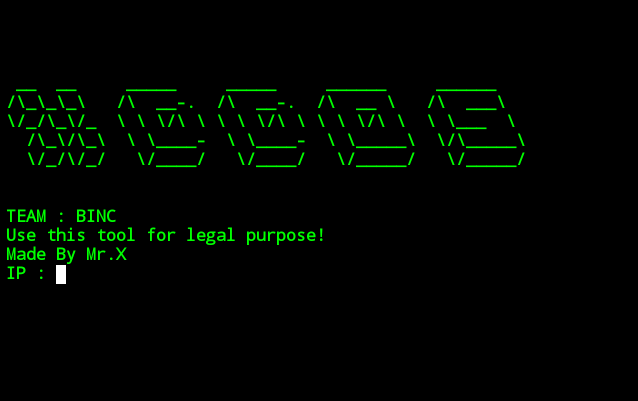

# Xddos


## introduction
This tool is a DDOS tool {denial-of-service} send botnet 6.5 mb per sec using IP address

## Instalations
```
$ apt update -y && apt upgrade -y
$ pkg install git
$ git clone https://github.com/Whomrx666/Xddos
$ cd Xddos
$ python Xddos.py
```

## Instructions
- **IP**: Enter the target public IP address
- **Port**: Make a port request. The default port is 80
- **Sent PerSec**: Request bot how much to send to the target

### Original Author
<a href="https://github.com/Whomrx666"></a>

Follow me: [Whatsapp](https://wa.me/6287855190571),[Youtube](https://youtube.com/@whomrx666),[Tiktok](https://www.tiktok.com/@whomr.x),[Telegram](https://www.tiktok.com/@whomr.x),[Telegram](https://t.me/@Whomr_X),&[Website](https://whomrxhackers.blogspot.com/)
